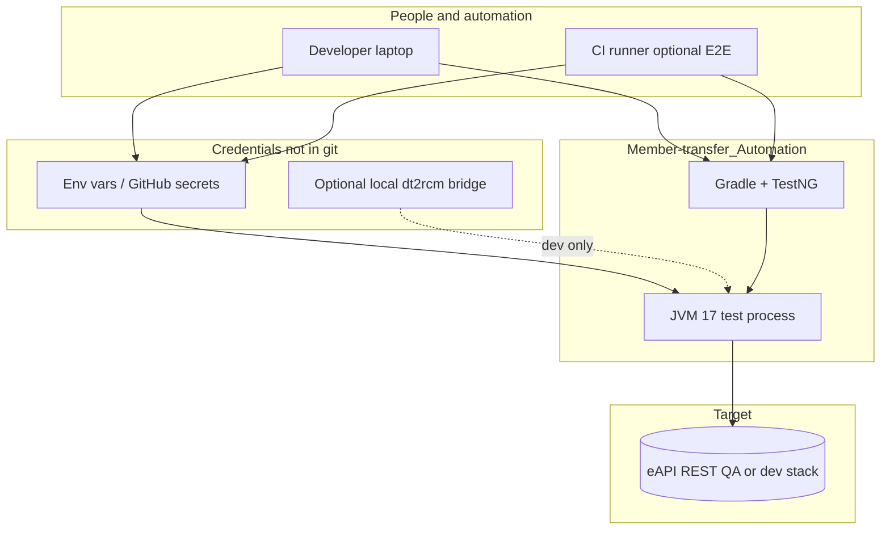
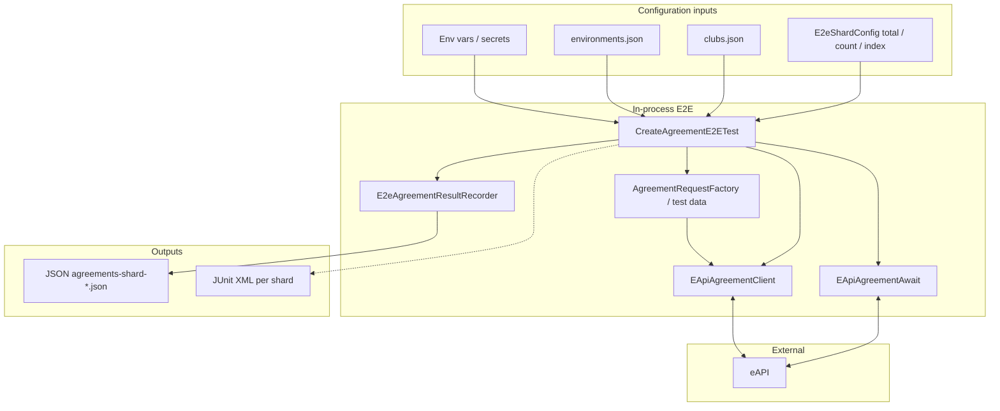
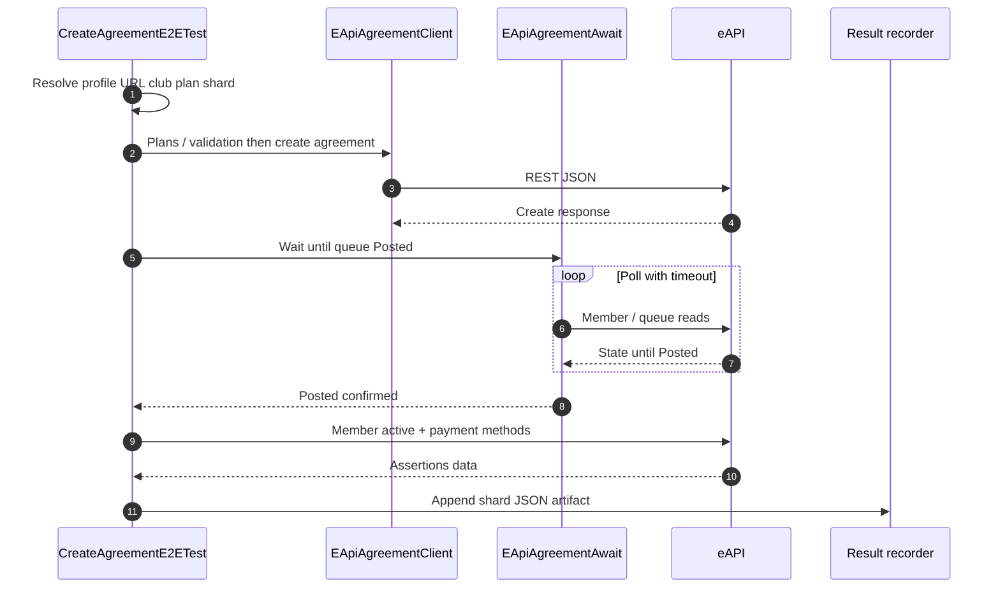

# Member-transfer Automation — Executive & Technical Wiki

**Audience:** Architects, Engineering Directors, VPs, Country / Regional leaders, and senior QA stakeholders.  
**Purpose:** Explain what was built, why it exists, how it compares to the legacy **dt2rcm_automation** approach, and how **Cursor (AI-assisted development)** accelerated delivery—without overselling guarantees on API latency or production scope.

**Related:** [README.md](../README.md) (operational runbook, secrets, CI troubleshooting).

---

## 1. Executive summary

**Member-transfer_Automation** is a **standalone** Java repository that runs **end-to-end (E2E)** tests against **real eAPI** for **agreement creation** (with **member transfer** scaffolding for future work). It was created so teams can:

- **Prove** agreement flows on QA / non-production stacks with **repeatable** automation.
- **Run and extend** agreement E2E **without** importing the full **dt2rcm_automation** monorepo.
- **Publish** results (logs + JSON artifacts) suitable for **POC**, **regression**, and **leadership visibility**.
- **Scale** load-style runs (1–100 agreements) with optional **sharding** for parallel execution across **multiple processes or CI runners**.

This is **not** a replacement for all dt2rcm coverage; it is a **focused, fast-to-run slice** aligned with the same business flow as dt2rcm’s `CreateAgreementTest`.

---

## 2. Business problem and outcome

| Challenge | Outcome with this repo |
|-----------|-------------------------|
| Agreement creation is business-critical but hard to demo consistently | Single command + secrets → **documented** happy path with assertions (success, queue **Posted**, member **Active**, payment methods). |
| Large automation suite is heavy for narrow API proofs | **Minimal** dependencies and **one** primary E2E class for agreement creation (`CreateAgreementE2ETest`). |
| Public or shared repos must not embed secrets | Credentials via **environment variables**, **GitHub Actions secrets**, or optional **local bridge** to dt2rcm `EApiHelper.java` (developer machines only). |
| Leadership needs evidence of speed and scale | Measured runs (see **§7**) including **before/after build overhead**, **per-agreement QA samples**, and **parallel shard** wall time. |

---

## 3. How Cursor was used (AI-assisted development)

**Cursor** is the IDE used to build and refine this repository with **AI pair-programming** (code generation, refactoring, test runs, and troubleshooting). Typical uses:

- **Scaffolding** Java packages, Gradle wiring, TestNG tests, and Rest Assured clients faster than greenfield typing alone.
- **Aligning behavior** with dt2rcm flows (steps, assertions, wait semantics) by reading existing README references and internal patterns.
- **Debugging** environment propagation (TestNG workers, GitHub Actions secrets → Gradle → JVM).
- **Hardening parallel runs** by diagnosing Gradle **test output collisions** when multiple `./gradlew` processes shared the same `build/test-results/` paths, and **isolating** JUnit XML / binary result directories **per shard** (`E2E_SHARD_INDEX`) in `build.gradle`.

**Cursor “Skills” (optional governance):**  
Cursor **Skills** are optional rule packs (e.g. test-plan authoring, PR babysitting). This project’s **core** delivery did not depend on a specific public Skill file; development followed **repository README**, **Gradle/TestNG conventions**, and **team security rules** (no committed secrets). If your org adopts Skills later, they can standardize how future contributors extend this wiki and tests.

---

## 4. Technical architecture (high level)

**Mermaid** figures below render as graphics in **GitHub**, **GitLab**, many **Confluence** macros, and VS Code / Cursor preview (export PNG/SVG from those viewers for slides). For **plain-text wikis**, email, or terminals that do not render Mermaid, use **Figure 0** in a **monospace** block (same style as a boxed “template” diagram).

### Figure 0 — ASCII template (architecture & E2E flow)

Copy or embed as preformatted text; keep a **fixed-width** font so the box aligns.

```text
┌─────────────────────────────────────────────────────────────────────────────┐
│        MEMBER-TRANSFER AUTOMATION — TECHNICAL ARCHITECTURE & E2E FLOW       │
├─────────────────────────────────────────────────────────────────────────────┤
│                                                                             │
│  CONFIG & CREDENTIALS (not committed to git)                                │
│  ───────────────────────────────────────────                                │
│  • EAPI_* or GH secrets; optional DT2RCM_AUTOMATION_ROOT (dev bridge)       │
│  • environments.json + clubs.json (profiles, clubs, URLs)                   │
│  • E2E_ENV_PROFILE / EAPI_BASE_URL; E2E_* shard + agreement counts          │
│                                                                             │
│  IN-REPO RUNTIME  ────────────────────────►  eAPI (QA / dev REST)           │
│  ───────────────────────────────────────────                                │
│  Gradle + TestNG (JVM 17) runs CreateAgreementE2ETest                       │
│       │                                                                     │
│       ├──► EApiAgreementClient  ──►  REST: plans, create agreement          │
│       ├──► EApiAgreementAwait   ◄──►  poll until queue Posted               │
│       ├──► AgreementRequestFactory (synthetic contact + card data)          │
│       └──► E2eAgreementResultRecorder                                       │
│                                                                             │
│  DOWNSTREAM FLOW (same intent as dt2rcm CreateAgreementTest)                │
│  ───────────────────────────────────────────────────────────                │
│       │                                                                     │
│       ▼                                                                     │
│  validate plans → create agreement → wait Posted → member Active            │
│       │                                                                     │
│       ▼                                                                     │
│  GET payment methods (assert) → append row → write shard JSON               │
│                                                                             │
│  OUTPUT & HANDOFF                                                           │
│  ─────────────────                                                          │
│  • Console + SLF4J logs for CI visibility                                   │
│  • build/e2e-agreement-results/agreements-shard-*.json                      │
│  • JUnit XML under per-shard dirs (build.gradle isolation)                  │
│  • Optional: summarize_agreement_results.py → markdown summary              │
│                                                                             │
├─────────────────────────────────────────────────────────────────────────────┤
│                          PARALLEL SCALE (optional)                          │
├─────────────────────────────────────────────────────────────────────────────┤
│                                                                             │
│  • Shared E2E_TOTAL_* / SHARD_*; unique E2E_SHARD_INDEX per Gradle process  │
│  • N parallel Gradle jobs; merge JSON; watch eAPI throttling / queues       │
│                                                                             │
└─────────────────────────────────────────────────────────────────────────────┘
```

### Figure 1 — System context (who talks to what)



### Figure 2 — Components inside the test run



### Figure 3 — Agreement E2E sequence (logical order)



**Flow (aligned with dt2rcm `CreateAgreementTest`):**

1. Resolve **profile** (e.g. `qa-eapi-dev`) → **eAPI base URL**.
2. Resolve **club**, **payment plan**, **shard** (total agreements, shard count, shard index).
3. For each agreement on this shard: **Get All Plans** / plan validation → **Create Agreement** (synthetic contact + draft card) → assert success.
4. **Poll** member until agreement queue is **Posted** (configurable timeout, same intent as dt2rcm `ApiAwaitUtils`).
5. Assert member **Active** and **GET payment methods** (card + slots).
6. Write **shard JSON** for CI artifacts and summaries.

---

## 5. Repository structure (what we built)

| Area | Path / artifact | Role |
|------|------------------|------|
| **Stack catalog** | `src/main/resources/e2e/environments.json` | Named profiles → `eapiBaseUrl`, optional Commerce / RCM links for verification narratives. |
| **Club catalog** | `src/main/resources/e2e/clubs.json` | Org/location metadata and links; optional **strict** check that club exists in catalog. |
| **Configuration** | `src/main/java/.../config/` | `EApiEnvironment`, `E2eCatalog`, `E2eShardConfig`, optional `Dt2rcmEApiCredentialBridge`. |
| **HTTP / API** | `src/main/java/.../eapi/`, `http/` | `EApiAgreementClient`, Rest Assured base config. |
| **Models** | `src/main/java/.../model/` | Request/response DTOs for agreements, plans, members, wallets. |
| **Support** | `src/main/java/.../support/` | `AgreementRequestFactory`, `AgreementTestData`, `EApiAgreementAwait`. |
| **Tests** | `src/test/java/.../eapi/CreateAgreementE2ETest.java` | Primary E2E; `MemberTransferE2ETest` scaffold (disabled by default). |
| **Results** | `build/e2e-agreement-results/agreements-shard-*.json` | Machine-readable run output for dashboards / wiki / CI summary scripts. |
| **CI** | `.github/workflows/` | **Gradle build** (compile-only, PR-safe); **eAPI Create Agreement E2E** (manual, needs secrets + network). |
| **Parallel-safe Gradle** | `build.gradle` | Per-shard **JUnit XML** and **binary test results** directories to avoid file races when `E2E_SHARD_INDEX` differs per process. |
| **CI summary helper** | `.github/scripts/summarize_agreement_results.py` | Optional markdown summary from JSON artifacts. |

### 5.1 Technology stack (everything in use)

| Layer | Technology | Version / notes | Role |
|-------|------------|-----------------|------|
| **Language** | Java | **17** (Gradle toolchain) | Implementation language. |
| **Build** | Gradle | **8.5** (wrapper) | Dependency resolution, compile, TestNG execution. |
| **Test framework** | TestNG | **7.9.0** | E2E test class, soft assertions, `@Test` descriptions. |
| **HTTP / API testing** | REST Assured | **5.4.0** | JSON calls to eAPI with path params and typed extraction. |
| **JSON** | Jackson (databind + XML module) | **2.17.0** | Serialize/deserialize request and response DTOs. |
| **Async polling** | Awaitility | **4.2.0** | Wait until agreement queue reaches **Posted** (with timeout + poll interval). |
| **Utilities** | Apache Commons Lang3 | **3.14.0** | String and general helpers where used. |
| **Boilerplate reduction** | Lombok | **1.18.32** | Builders/data classes on models (`compileOnly` + processors). |
| **Logging** | SLF4J API + **slf4j-simple** (tests) | **2.0.12** | Structured logs in await/polling code; E2E steps also print to **stdout** for CI visibility. |
| **Configuration data** | JSON resources | — | `environments.json`, `clubs.json` (no secrets). |
| **CI / DevOps** | GitHub Actions | `actions/checkout`, `setup-java`, `upload-artifact` | Compile workflow + manual agreement E2E workflow. |
| **Scripting** | Python **3** | — | `summarize_agreement_results.py` for workflow summaries. |
| **Target system** | **eAPI** (REST) | Profile-driven base URL | Real QA/dev-region stack (e.g. `qa-eapi-dev`). |
| **Optional dev bridge** | Local **dt2rcm_automation** checkout | `EApiHelper.java` | Reads same three header values as `:obc` tests when `EAPI_*` env vars are unset (developer machines only). |

**Not in scope for this repo:** Application server, database, or UI framework—the suite is a **client** of eAPI only.

---

## 6. Comparison: this repository vs dt2rcm_automation

| Dimension | **dt2rcm_automation** | **Member-transfer_Automation** |
|-----------|------------------------|----------------------------------|
| **Scope** | Large multi-module suite (many products, configs, and tests). | **Narrow slice**: agreement E2E (+ transfer scaffold). |
| **Run model** | Typically `:obc:test` (or similar) with **module classpath**, internal `services.json` / properties, and broader setup. | **Single small Gradle project**: `./gradlew test --tests …CreateAgreementE2ETest`. |
| **Cold start / cognitive load** | Higher: more modules, more context to run “one agreement proof.” | Lower: clone, JDK 17, env/secrets, one test class. |
| **Credentials** | Historically embedded in `EApiHelper.java` for internal convenience. | **Designed for secrets**: `EAPI_*` env vars; optional **local** read from dt2rcm file **without** copying secrets into this repo. |
| **CI on GitHub-hosted** | Same **DNS** constraints if eAPI hostnames are internal-only. | **Compile-only** workflow stays green; live E2E documented as **manual** / **internal runner** when needed. |
| **Time to “prove one agreement”** | Dominated by **Gradle configuration resolution**, **multi-module build**, and **suite** size—not only eAPI latency. | **Smaller build surface** + same eAPI wait behavior → typically **faster wall-clock for the same logical E2E** on a developer laptop (exact delta varies by machine and cache). |
| **Bulk agreements (50 / 100)** | Would still run **sequentially** unless you add **matrix / fan-out** yourself. | Built-in **`E2E_TOTAL_AGREEMENTS`** (max 100) + **`E2E_SHARD_COUNT` / `E2E_SHARD_INDEX`** for **parallel** fan-out; Gradle outputs isolated **per shard** so parallel processes do not corrupt each other. |

**Important nuance:** Per-agreement time is still bounded by **eAPI and queue posting** (often on the order of **tens of seconds** per agreement in QA). This repo **does not** remove that dependency; it removes **monorepo overhead** and adds **clear sharding + artifacts** for scale demos.

---

## 7. Timing and scale — before vs after (examples)

Use this section in **POC decks**. Numbers below mix **machine-measured** samples and **planning math**. Always label slides **“QA / dev-region; not an SLA.”**

### 7.1 What “before” vs “after” means

| Term | Meaning |
|------|--------|
| **Before (dt2rcm path)** | Running agreement coverage inside **`dt2rcm_automation`**, e.g. `./gradlew :obc:test` with `CreateAgreementTest` and QA flags. You pay **full multi-module Gradle** cost **before** the first HTTP call. |
| **After (Member-transfer path)** | Running **`CreateAgreementE2ETest`** in this **single-project** repo against the **same class of eAPI** (aligned steps). You pay **small compile** cost; the same **queue / Posted** waits still apply per agreement. |

### 7.2 Build overhead (no eAPI calls) — measured same laptop

These samples isolate **“how long until Java test code can start”** (compile test sources). **Hardware and Gradle caches affect results.**

| Command (abbrev.) | Approx. wall time | Notes |
|-------------------|-------------------|--------|
| `dt2rcm_automation`: `./gradlew :obc:compileTestJava --no-daemon` | **~97 s** (`real 97.44`) | Measured **2026-04-14** on the maintainer’s Mac; first run can include wrapper/download noise. |
| **Member-transfer**: `./gradlew clean compileJava compileTestJava --no-daemon` | **~4.4 s** (`real 4.39`) | Same day, same machine; single module, minimal graph. |

**Story for leadership:** For a **narrow API proof**, the **Member-transfer** repo cuts **compile / configuration** overhead by roughly **an order of magnitude** versus compiling the **`obc`** test classpath in the full monorepo—**before** any agreement is created. That makes **iterating during development and demos** materially faster.

### 7.3 End-to-end agreement runs — Member-transfer (latest implementation)

These include **real eAPI** (create agreement → wait **Posted** → member + payment assertions). **Club 06060**, profile **`qa-eapi-dev`**, **INSTALLMENT**, unless noted.

| Scenario | Approx. wall time | How to interpret |
|----------|-------------------|------------------|
| **1 agreement** (first run in a session, includes compile) | **~52 s** (`BUILD SUCCESSFUL in 52s` in POC run, Apr 2026) | Dominated by **one** queue-to-Posted wait (~tens of seconds) + Gradle. |
| **10 agreements**, sequential, one JVM (`E2E_SHARD_COUNT=1`) | **~6.3 min** (`real 378.95 s`; Gradle **6m 18s**) | **~38 s per agreement** average (create + Posted + checks). |
| **2 agreements**, **2 parallel shards** (two Gradle processes, distinct `E2E_SHARD_INDEX`) | **~29 s** wall clock for **both** to finish | Shows **parallel fan-out** after Gradle **per-shard** test output isolation fix. |
| **50 agreements** (planning, sequential) | **~32 min** | \(50 \times \sim 38\text{ s}\); add extra if cold compile. |
| **100 agreements** (planning, sequential) | **~64 min** | Same average assumption. |

**We did not publish a fresh `CreateAgreementTest` wall-clock from dt2rcm in this wiki** because it equals **(obc build + test execution)** and varies with **cache, VPN, and suite filters**. For an **apples-to-apples** slide, your team can run:

```bash
cd /path/to/dt2rcm_automation
/usr/bin/time -p ./gradlew :obc:test --no-daemon --tests com.abcfinancial.test.eapi.agreement.CreateAgreementTest \
  -DenvType=qa -DreskinEnv=dev -DclubNumber=06060
```

and paste the **`real`** line next to the Member-transfer command from the README.

### 7.4 Parallel scale (reminder)

With **`E2E_TOTAL_AGREEMENTS=50`** and **`E2E_SHARD_COUNT=5`**, each of five runners does **10** agreements **in series**; **calendar** time trends toward **~one runner’s duration** (~**6–7 min** in the same QA conditions as the 10-agreement sample), subject to **eAPI throttling**.

**Disclaimer for leadership slides:** All timings are **environment-dependent**. Label them as **QA / dev-region measurements**, not production SLAs.

---

## 8. Security and compliance talking points

- **No secrets in git** for this automation model: use **CI secrets** and **private** `gradle.properties` where allowed.
- **Synthetic** member and card data for non-production runs (see README / test data builders).
- **Optional** local credential bridge reads dt2rcm **only on developer workstations**; **do not** rely on that for GitHub-hosted runners unless dt2rcm is present and policy allows it.

---

## 9. Roadmap and honest limitations

**Strengths**

- Clear **alignment** with dt2rcm agreement flow for **credibility** with engineering teams.
- **Independent** evolution of DTOs and clients for this slice.
- **Artifacts** and **workflows** suitable for management demos.

**Limitations (say these once)**

- **Internal DNS:** Public GitHub runners often cannot resolve internal eAPI hosts; use **self-hosted** runners, **internal CI**, or **local** runs.
- **Parallelism:** High fan-out may hit **rate limits** or slower queues; tune shard count for your stack.
- **Coverage:** This repo **does not** replace full dt2rcm regression; it **complements** it for agreement (and future transfer) focus.

---

## 10. Quick links

| Resource | Location |
|----------|----------|
| Runbook & env vars | [README.md](../README.md) |
| Agreement E2E test | `src/test/java/com/membertransfer/e2e/eapi/CreateAgreementE2ETest.java` |
| Shard configuration | `src/main/java/com/membertransfer/e2e/config/E2eShardConfig.java` |
| Manual CI workflow | `.github/workflows/eapi-create-agreement.yml` |
| PR-safe compile CI | `.github/workflows/gradle-build.yml` |

---

## 11. Glossary, prerequisites, and ownership (fill in for your org)

| Item | Guidance |
|------|-----------|
| **eAPI** | HTTP API used to create agreements and read member / wallet state. |
| **Posted** | Agreement queue state the test waits for (aligned with dt2rcm `ApiAwaitUtils` semantics). |
| **Shard** | A slice of agreement indices when `E2E_TOTAL_AGREEMENTS` is split across parallel runners (`E2E_SHARD_INDEX` / `E2E_SHARD_COUNT`). |
| **Prerequisites** | **JDK 17**, network to eAPI, valid **`EAPI_*`** headers (or local dt2rcm bridge on dev laptops only). |
| **Ownership** | Add **team name**, **Slack / Teams channel**, and **escalation** (e.g. QA lead + platform architect) in your internal copy of this wiki. |

---

## 12. Document control

| Version | Date | Notes |
|---------|------|--------|
| 1.0 | 2026-04-14 | Initial wiki: executive summary, Cursor usage, structure, dt2rcm comparison, timing, security. |
| 1.1 | 2026-04-14 | Added **technology stack (§5.1)**, **before/after timing examples (§7.1–7.3)** including measured **dt2rcm `:obc:compileTestJava`** vs **Member-transfer clean compile**, Member-transfer E2E samples, parallel **2-shard** example, **glossary / prerequisites / ownership** table (§11). |
| 1.2 | 2026-04-15 | **§4 Technical architecture** expanded with **Figure 0** (ASCII template) and **Figures 1–3** (Mermaid: system context, components and outputs, agreement E2E sequence). |

*Maintainer:* Update the table when timelines, workflows, or leadership messaging change. Re-run **§7.2** benchmarks after major Gradle or repo restructuring.
